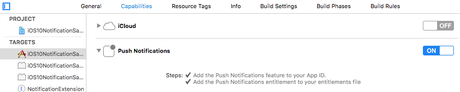
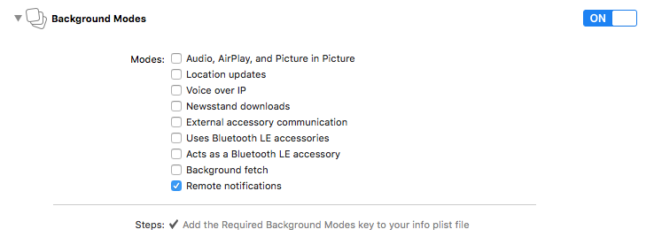
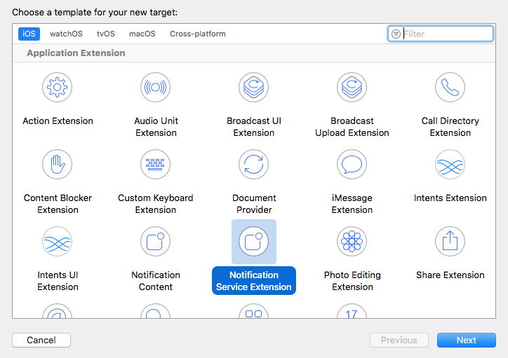

# SHNotificationContent

[]()

### A Notification Content Extension class to display custom content interfaces for iOS 10 push notifications

Apple introduces push notification feature in iOS 10 and guess what these are more richer and interactional. Now we can view photos, gifs, watch videos, and listen to the audio from inside a notification without open that app.

When push notification have media content than its a higher chance to increase the open rate and more engagement in any app.

#### Configure your app for Rich Push Notification and add a Notification Service Extension target to your app

Go to your project target and click on Capabilities and ensure that ‘Push Notifications’ is enabled and that ‘Remote notifications’ is selected under Background Modes:





Go to AppDelegate.swift and import UserNotification.framework in appdelegate and add this code in didFinishLaunchingWithOptions:

```
NUserNotificationCenter.current().delegate = self

UNUserNotificationCenter.current().requestAuthorization(options: [.sound, .alert, .badge]) {(granted, error) in
// actions based on whether notifications were authorized or not
if (granted) {
UIApplication.shared.registerForRemoteNotifications()
}
}
```
You can enable Rich Push Notification via [Notification Service Extension](https://developer.apple.com/documentation/usernotifications/unnotificationserviceextension):

Create a Notification Service Extension in your project. To do that, in Xcode, select File -> New -> Target and choose the Notification Service Extension template.



Once you’ve added the new target, you’ll have a new file called NotificationService.swift.Note: Notification Service Extension has a separate Apple App ID and Provisioning profile!
#### Note that notification extension has its own Bundle Id (ex: com.shephertz.demo.NotificationService) as well as its own Apple App ID and Provisioning profile which must be set up in Apple Developer Portal separately.

Open this class, and write this code in did Receive(: with Content Handler:) delegate method to serve any media in the notification.The code in this method looks like this:


```

```

#### Configure your app for Rich Push Notification and add a Notification Content Extension target to your app
